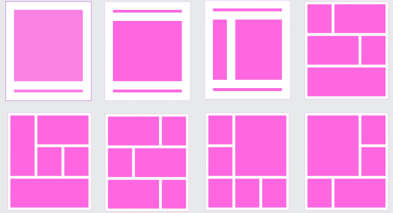

# Layouts Padrões com HTML e CSS

## Descrição do Projeto

Este projeto tem como objetivo a construção de uma série de layouts padrões utilizando apenas HTML e CSS. Os layouts estão definidos no arquivo **layouts-padroes.penpot**.

A imagem dos layouts encontra-se abaixo:

<figure>
  
</figure>

## Objetivo

O objetivo deste projeto é didático, para ajudar a você que está inciando no front-end a desenvolver alguns dos principais layouts usando flex box.

## Tecnologias Utilizadas

- HTML5
- CSS3 (incluindo Flexbox e Grid Layout)
- Penpot (para referência do design)

## Estrutura do Projeto

A estrutura de diretórios do projeto é organizada da seguinte forma:

```
layouts-padroes/
│-- assets-readme/     # Pasta para imagens, ícones e outros recursos visuais contidos neste readme
│-- layouts/           # Código HTML de cada layout
│   │-- layout1/       # Códigos HTML e CSS para o layout 01
│   │-- layout2/       # Códigos HTML e CSS para o layout 02
│   │-- ...            # Outros layouts
│-- global.css         # Estilos globais
│-- README.md          # Documentação do projeto
```

## Bibliografia

Os layouts presentes neste projeto foram retirados, sofrendo pequenas modificações, do site <https://github.com/penpot/penpot-files/blob/main/Basic%20layouts%20template.penpot>
